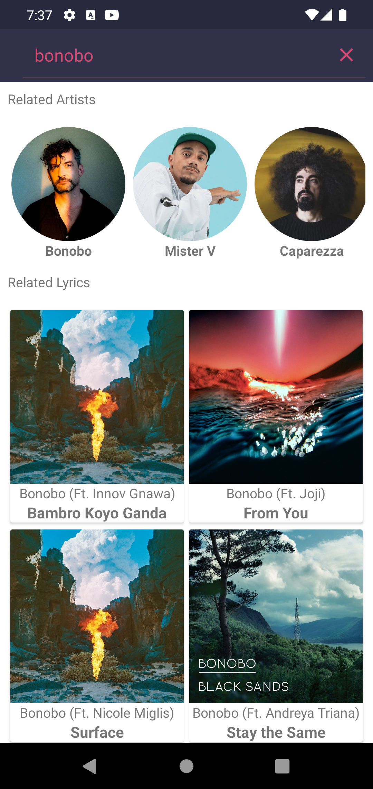
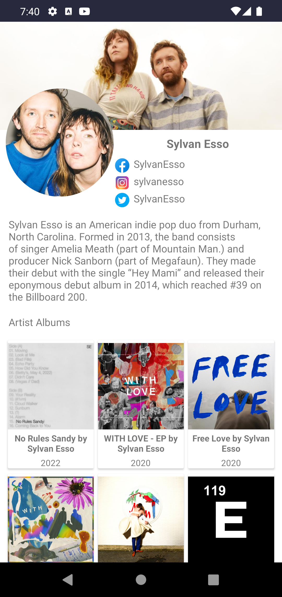
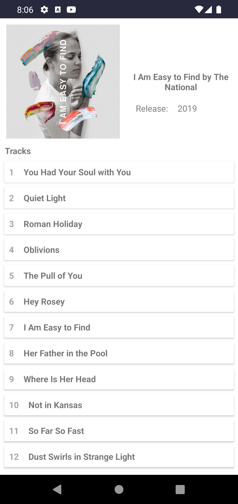
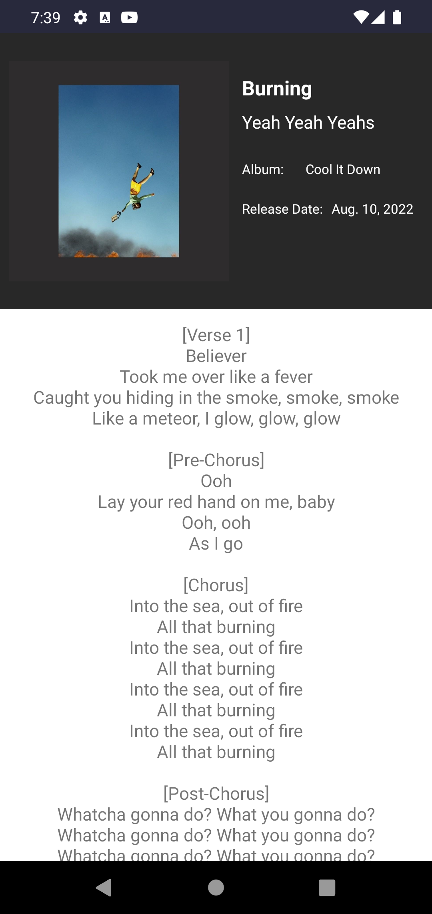

# Sing It Out

***This application in progress..***

"Sing It Out" gives you information about artists and music lyrics:
- Searching of artists or lyrics
- Artist information (albums, tracks and lyrics)

| Search Screen | Artist Info|
| ------------- | ------------- |
||

|Album Screen|Lyrics Screen|
| ------------- | ------------- |
|   |  |

## Tech stack & Open-source libraries
* Minimum SDK level 23
#### 1. Architecture
* MVVM Architecture
* Clean Code
#### 2. Data
* Retrofit
* OkHttp
* Paging 3
* Moshi 
#### 3. Base Structure
* Single Activity
* Fragments
* UseCases
* Coroutines + Flow
#### 4. UI
* Glide
* Color Palette Api
#### 5. DI
* Dagger 2
#### 5. Navigation
* Cicerone
